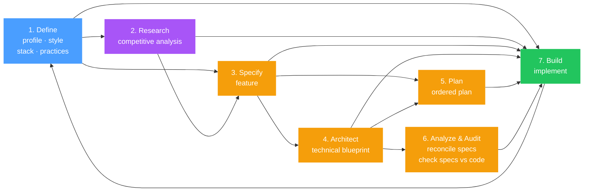

# gspec

**Structured product specifications for AI-assisted development.**

AI coding tools are powerful, but they build better software when they understand *what* you're building and *why*. gspec gives your AI tools that context — a set of living specification documents that define your product, guide implementation, and stay in sync as your project evolves.

Without structured context, AI tools guess. They make assumptions about your audience, your tech stack, your design language, and your quality standards. gspec eliminates that guesswork by creating a shared specification layer that any AI coding tool can read and follow.

## The Problem

Two things go wrong when building with AI:

1. **AI tools lack product context.** They don't know your target audience, your design system, your architectural decisions, or your engineering standards. Every prompt starts from zero.
2. **Specs drift from reality.** Even when you write great specs upfront, they fall out of sync as the project evolves — leading to inconsistency, rework, and compounding confusion.

gspec solves both problems. It provides a structured specification workflow that gives AI tools rich context, and keeps that context accurate as your codebase changes.

## How It Works

gspec installs as a set of slash commands (skills) in your AI coding tool. Each command plays a specific role — business strategist, product manager, architect, designer, engineer — and produces a structured Markdown document in your project's `gspec/` directory.

These documents become the shared context for all subsequent AI interactions. When you implement features, your AI reads the specs. When the code changes, gspec's always-on spec sync keeps them in sync automatically.

### The Workflow

The only commands you *need* are the four fundamentals and `/gspec-implement`. Everything else exists to help when your project calls for it.

The fundamentals give your AI tool enough context to build well — it knows what the product is, how it should look, what technologies to use, and what engineering standards to follow. From there, `/gspec-implement` can take a plain-language description and start building. The remaining commands — `/gspec-research`, `/gspec-feature`, `/gspec-architect`, `/gspec-plan`, `/gspec-analyze`, and `/gspec-audit` — add structure and rigor when the scope or complexity warrants it.



> **Blue** = required foundation. **Purple/Yellow** = optional depth. **Green** = implementation.
> Every path starts with Define and passes through Build. The steps in between depend on your project's complexity.

**1. Define the Fundamentals** — Establish the foundation that drives every decision.

| Command | Role | What it produces |
|---|---|---|
| `/gspec-profile` | Business Strategist | Product identity, audience, value proposition, positioning |
| `/gspec-style` | UI/UX Designer | Visual design language, design tokens, component patterns. Produces either a renderable `style.html` design system or a `style.md` Markdown guide |
| `/gspec-stack` | Software Architect | Technology stack, frameworks, infrastructure, architecture |
| `/gspec-practices` | Engineering Lead | Development standards, code quality, testing, workflows |

**2. Research the Market** *(optional)* — Understand the competitive landscape before building.

| Command | Role | What it produces |
|---|---|---|
| `/gspec-research` | Product Strategist | Competitive analysis, feature matrix, gap identification, and additional feature proposals |

Use `/gspec-research` when you want to understand what competitors offer, identify table-stakes features you might be missing, find differentiation opportunities, and **propose additional features** that serve your product's mission. It reads competitors from your product profile, produces a persistent `gspec/research.md` file, and can optionally generate feature PRDs from its findings and proposals. This is where new feature ideas are surfaced and vetted — not during implementation.

**3. Specify What to Build** *(optional)* — Define features and requirements.

| Command | Role | What it produces |
|---|---|---|
| `/gspec-feature` | Product Manager | One or more feature PRDs with prioritized capabilities |

Use `/gspec-feature` when you want detailed PRDs with prioritized capabilities and acceptance criteria before building. It handles both single features and larger bodies of work — if the scope is large enough, it will propose a multi-feature breakdown for your approval. For smaller tasks or rapid prototyping, you can skip straight to `/gspec-implement` with a plain-language description.

**4. Architect** *(optional)* — Translate specs into a concrete technical blueprint.

| Command | Role | What it produces |
|---|---|---|
| `/gspec-architect` | Senior Architect | Technical architecture document with data models, API design, project structure, auth flows, technical gap analysis, and Mermaid diagrams |

Use `/gspec-architect` when your feature involves significant technical complexity — new data models, service boundaries, auth flows, or integration points that benefit from upfront design. It also **identifies technical gaps and ambiguities** in your specs and proposes solutions, so that `/gspec-implement` can focus on building rather than making architectural decisions. For straightforward features, `/gspec-implement` can make sound architectural decisions on its own using your `stack` and `practices` specs.

**5. Plan** *(optional)* — Decompose a feature PRD into ordered work.

| Command | Role | What it produces |
|---|---|---|
| `/gspec-plan` | Engineering Lead | A sibling `gspec/features/<feature>.plan.md` file with stable task IDs, explicit `deps:` lines, and `[P]` markers for parallel-safe work |

Use `/gspec-plan` after `/gspec-feature` (and after `/gspec-architect` when it exists) for any feature large enough that build order matters or that has work which could legitimately run in parallel. The output is what `/gspec-implement` consumes — when every in-scope feature has a plan file, `/gspec-implement` skips its own plan-mode step and executes the plan file directly (the plan was already approved during `/gspec-plan`). Trivial features can skip this step and go straight to `/gspec-implement`, which falls back to PRD-checkbox-driven planning with its own plan-mode approval.

**6. Analyze & Audit** *(optional)* — Reconcile discrepancies before building, and keep specs honest as the codebase evolves.

| Command | Role | What it does |
|---|---|---|
| `/gspec-analyze` | Specification Analyst | Cross-references specs against **each other**, identifies contradictions, and walks you through reconciling each one. Optionally takes a feature slug to scope to one PRD and add an ambiguity sweep against the document itself |
| `/gspec-audit` | Specification Auditor | Cross-references specs against the **actual codebase**, finds drift (stack mismatches, stale data models, design tokens that don't match the stylesheet, capability checkboxes that lie), and walks you through updating specs to match reality |

Use `/gspec-analyze` after `/gspec-architect` (or any time multiple specs exist) to catch spec-to-spec conflicts before `/gspec-implement` sees them — for example, if the stack says PostgreSQL but the architecture references MongoDB. Pass a feature slug (`/gspec-analyze user-authentication`) to scope the run to one PRD and surface ambiguity inside it — missing acceptance criteria, vague verbs, undefined nouns, implicit state assumptions, missing edge cases, and unmeasurable success metrics. Especially useful on aged or imported PRDs that may have accumulated unstated assumptions.

Use `/gspec-audit` periodically — before a major release, after a long sprint, or any time you suspect docs have drifted from code. Audit reads package manifests, configs, source files, and test output, then asks you per-finding whether to update the spec to match the code, keep the spec and fix the code separately, or defer. Each finding is presented one at a time with the spec quote and the code evidence side by side. Audit never modifies code.

**7. Build** — Implement with full context.

| Command | Role | What it does |
|---|---|---|
| `/gspec-implement` | Senior Engineer | Reads all specs (including any `*.plan.md` files), plans the build order, and implements |

**Spec Sync** — gspec includes always-on spec sync that automatically keeps your specification documents in sync as the code evolves. This is installed alongside the skills and requires no manual intervention — when code changes affect spec-documented behavior, the sync rules prompt your AI tool to update the relevant gspec files.

**Design-tool integration** — The style guide supports both Markdown (`style.md`) and a renderable HTML design system (`style.html`) that design-aware AI tools can open, render, and reason about directly. Drop mockups from external design tools (Figma, v0, Framer AI, etc.) into `gspec/design/` and `/gspec-implement` will use them as authoritative visual guidance when building UI.

**Maintenance** — Keep specs up to date with the latest gspec format.

| Command | Role | What it does |
|---|---|---|
| `/gspec-migrate` | Migration Specialist | Updates existing gspec documents to the current format when you upgrade gspec, preserving all content |

Each command is self-contained and will ask clarifying questions when essential information is missing.

## Installation

Run from your project root:

```bash
npx gspec
```

The CLI will ask which platform you're installing for:

| Platform | Install path |
|---|---|
| Claude Code | `.claude/skills/` |
| Cursor | `.cursor/commands/` |
| Antigravity | `.agent/skills/` |
| Codex | `.agents/skills/` |
| Open Code | `.opencode/skills/` |

You can skip the prompt by passing a target directly:

```bash
npx gspec --target claude
npx gspec --target cursor
npx gspec --target antigravity
npx gspec --target codex
npx gspec --target opencode
```

That's it. The commands are immediately available in your AI tool.

If you have saved specs in `~/.gspec/` from a previous project, the installer will offer to seed your new project from them — either from a playbook or by picking individual specs.

## Save & Restore

Once you've built specs you're happy with, save them for reuse across projects:

```bash
gspec save        # Save a spec from the current project to ~/.gspec/
gspec restore     # Restore a saved spec into the current project
gspec playbook    # Bundle multiple saved specs into a reusable playbook
```

Saved specs are organized by type in `~/.gspec/` (profiles, stacks, styles, practices, features). Playbooks bundle multiple specs together so you can seed an entire project with one command:

```bash
gspec restore playbook/my-starter
```

## Extensions

Author your own skills and have them auto-installed alongside the built-in `gspec-*` commands in every project. Extensions live in `~/.gspec/extensions/` as Markdown files with `name` and `description` frontmatter and the same shape as anything in `commands/`.

```bash
gspec extension save ./my-deploy.md   # Install a local skill file as a user extension
gspec extension list                  # See what's installed
gspec extension remove my-deploy      # Delete from ~/.gspec/extensions/
```

When you next run `npx gspec` in a project, the installer copies the built-in skills first, then emits each valid extension into the same per-platform install directory using the same formatting. Extension names that collide with built-in `gspec-*` skills are rejected with an error; malformed or duplicate extensions are skipped with a warning.

## Output Structure

All specifications live in a `gspec/` directory at your project root:

```
project-root/
└── gspec/
    ├── profile.md          # Product identity and positioning
    ├── style.html          # Visual design language (HTML — renderable design system)
    │                       # or style.md if you prefer a Markdown style guide
    ├── stack.md            # Technology stack and architecture
    ├── practices.md        # Development standards
    ├── architecture.md     # Technical architecture blueprint
    ├── research.md         # Competitive analysis and feature gaps
    ├── design/             # Optional — external mockups read during implementation
    │   ├── dashboard.html
    │   ├── checkout-flow.png
    │   └── ...
    └── features/
        ├── user-authentication.md
        ├── dashboard-analytics.md
        └── ...
```

Most specs are Markdown. The style guide can also be a self-contained HTML file (`style.html`) that renders the design system as live swatches, typography specimens, and styled component previews — ideal for design-aware AI tools. The optional `gspec/design/` folder holds mockups (HTML, SVG, PNG, JPG) exported from external design tools like Figma, v0, or Framer AI; `/gspec-implement` reads them to reason about layout and visual intent. All files live in your repo, are version-controlled with your code, and are readable by both humans and AI tools.

## Key Design Decisions

**Spec-first development.** Every implementation decision traces back to a specification. AI tools don't guess — they follow documented decisions about your product, stack, design, and standards.

**Living documents.** Specifications aren't write-once artifacts. The always-on spec sync keeps them in sync as your project evolves, so they remain a reliable source of truth.

**Role-based commands.** Each command adopts a specific professional perspective — product manager, architect, designer, engineer. This ensures specifications are comprehensive and consider multiple viewpoints.

**Incremental implementation.** Feature PRDs use checkboxes to track which capabilities have been built. The `implement` command reads these to know what's done and what's remaining, so it can be run multiple times as your project grows.

**Research and architecture own discovery.** Feature proposals and technical gap analysis happen *before* implementation — in `/gspec-research` and `/gspec-architect` respectively. `/gspec-research` surfaces new feature ideas through competitive analysis and product-driven reasoning. `/gspec-architect` identifies technical gaps and resolves ambiguities. This separation keeps `/gspec-implement` focused on building what the specs define, rather than proposing scope changes mid-build.

**Platform-agnostic.** A single set of source commands builds for Claude Code, Cursor, Antigravity, and Codex. The build system handles platform-specific formatting so the commands stay consistent across tools.

## Supported Platforms

| Platform | Version | Status |
|---|---|---|
| [Claude Code](https://docs.anthropic.com/en/docs/claude-code) | Skills format | Supported |
| [Cursor](https://www.cursor.com/) | Commands format | Supported |
| [Antigravity](https://www.antigravity.dev/) | Skills format | Supported |
| [Codex](https://developers.openai.com/codex/cli/) | Skills format | Supported |
| [Open Code](https://opencode.ai/) | Skills format | Supported |

## Project Status

gspec is early-stage and actively evolving. The core workflow is stable, but commands and output formats may change as AI tool capabilities expand and user feedback comes in.

If you run into issues or have ideas, please [open an issue](https://github.com/gballer77/gspec/issues).

## License

[MIT](LICENSE)
