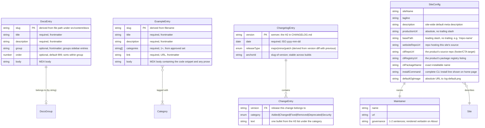
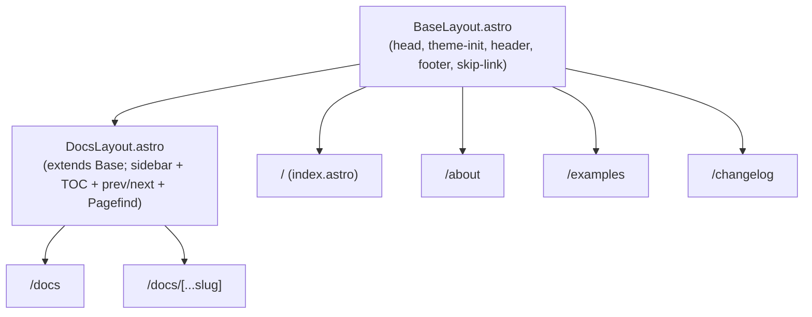

# Technical Architecture

## 1. Overview

This is the architecture for a **static documentation and marketing site** built with Astro 5 and deployed to GitHub Pages, as defined in `gspec/stack.md`. Pages are generated at build time from `.astro` templates, Markdown/MDX content collections, and a small set of build-time data sources (a Keep-a-Changelog file, a single site-config module). The output is plain HTML, CSS, and a minimal amount of JavaScript shipped only where interactivity is required (theme toggle, search palette, copy-to-clipboard, mobile nav).

**Key architectural patterns:**

- **Islands architecture (Astro)** — pages are rendered to static HTML at build time; interactive components are isolated islands with explicit hydration directives (`client:idle`, `client:visible`). The site ships zero JavaScript on routes that don't need it.
- **Content-as-data via content collections** — long-form content (docs, examples) lives in `src/content/` and is consumed through Astro's Content Collections API with Zod-validated frontmatter. Structured data sources (changelog, site config) live outside the collections in their conventional locations.
- **Single-source site configuration** — every project-identity value (URLs, package name, maintainer, base path) lives in one config module and is imported wherever it's needed. A change is one edit.
- **Base-path discipline** — all internal URLs go through one helper that prefixes `import.meta.env.BASE_URL`. A domain switch is a one-config-line change per `gspec/stack.md` §14.
- **Layout composition, not duplication** — `BaseLayout.astro` wraps every route with the site shell (header, footer, head meta, theme-init script); `DocsLayout.astro` extends the base with the sidebar + TOC + prev/next. Pages declare their content; layouts declare their chrome.

**System boundaries:**

- **In scope:** the Astro project, content collections, the build pipeline (build → link/asset integrity check → search-index post-build → deploy), and the GitHub Pages deployment.
- **External (read-only) services:** the project's source-code-hosting platform (linked from CTAs and the footer; not consumed at build time), the package registry (linked from CTAs; not consumed). No runtime backend, no database, no third-party SaaS.

**Feature traceability:** every feature in `gspec/features/` is realized as either a layout, a page route, a shared component, a content collection, or a build-time data source. The map appears under §5 (page/component) and §3 (data model).

---

## 2. Project Structure

### Directory Layout

The Astro project lives at the **repo root** (not in a `pages/` subdirectory — see Gap §9.1):

```text
maester-website/                # repo root; Astro project root
├── astro.config.mjs            # Astro config: site URL, base path, integrations (mdx, sitemap, tailwind)
├── tailwind.config.mjs         # Tailwind v4 theme.extend tokens (mapped from gspec/style.html)
├── tsconfig.json               # Loose TS config for IDE support; no strict typing required for content site
├── package.json                # Astro, @astrojs/mdx, @astrojs/sitemap, @astrojs/tailwind, tailwindcss, @tailwindcss/typography, prettier, prettier-plugin-astro, vitest, pagefind, gray-matter (for changelog parsing)
├── lychee.toml                 # Link/asset integrity checker config (used in CI Test stage)
├── pagefind.json               # Pagefind config (optional; defaults usually work)
├── CHANGELOG.md                # Keep-a-Changelog-format release notes; the changelog page is generated from this
├── README.md                   # Per practices.md §4
├── DEPLOYMENT.md               # Per practices.md §4
├── .github/
│   └── workflows/
│       └── deploy.yml          # Build → Lychee → Pagefind → Deploy via actions/deploy-pages
├── public/
│   ├── favicon.svg             # Site favicon
│   ├── og-default.png          # Default Open Graph / Twitter card image (1200×630)
│   └── diagrams/               # Concept diagrams as SVGs; theme-neutral
│       └── *.svg
├── src/
│   ├── pages/                  # Astro file-based routes
│   │   ├── index.astro         # Home — landing/hero (covers [[home-page]])
│   │   ├── about.astro         # About (covers [[about-page]])
│   │   ├── changelog.astro     # Changelog page (covers [[changelog-page]])
│   │   ├── examples/
│   │   │   └── index.astro     # Examples gallery (covers [[examples-page]])
│   │   └── docs/
│   │       ├── index.astro     # Docs landing (covers [[documentation-section]])
│   │       └── [...slug].astro # Renders any docs-collection entry via getStaticPaths
│   ├── layouts/
│   │   ├── BaseLayout.astro    # Site shell: <html data-theme>, head, header, footer, theme-init script, skip-link
│   │   └── DocsLayout.astro    # Extends Base; adds sidebar + TOC + prev/next + Pagefind script
│   ├── components/
│   │   ├── shell/              # Pieces of the site shell
│   │   │   ├── Header.astro
│   │   │   ├── Footer.astro
│   │   │   ├── PrimaryNav.astro
│   │   │   ├── MobileNav.astro     # Client-hydrated disclosure menu
│   │   │   ├── ThemeToggle.astro   # Client-hydrated
│   │   │   ├── SearchTrigger.astro # Client-hydrated (opens palette)
│   │   │   └── SkipLink.astro
│   │   ├── docs/               # Docs-specific UI
│   │   │   ├── Sidebar.astro
│   │   │   ├── TableOfContents.astro
│   │   │   ├── PrevNext.astro
│   │   │   ├── HeadingAnchor.astro # Heading slug + copy-link affordance
│   │   │   └── SearchPalette.astro # Client-hydrated (Pagefind UI)
│   │   ├── code/               # Shared code-block component (covers [[code-snippets]])
│   │   │   ├── CodeBlock.astro
│   │   │   └── CopyButton.astro    # Client-hydrated
│   │   ├── seo/                # SEO/metadata (covers [[seo-metadata]])
│   │   │   └── MetaTags.astro      # Imported by BaseLayout; emits title/description/OG/Twitter/canonical
│   │   ├── home/               # Sections used only by the home page
│   │   │   ├── Hero.astro
│   │   │   ├── ConceptOverview.astro
│   │   │   ├── KeyBenefits.astro
│   │   │   └── InstallSnippet.astro
│   │   ├── about/              # Sections used only by the about page
│   │   │   ├── StorySection.astro
│   │   │   ├── MissionSection.astro
│   │   │   ├── MaintainersSection.astro
│   │   │   └── GetInvolved.astro
│   │   ├── examples/
│   │   │   └── ExampleCard.astro
│   │   └── changelog/
│   │       └── ReleaseEntry.astro
│   ├── content/
│   │   ├── config.ts           # Zod schemas for `docs` and `examples` collections (see §3)
│   │   ├── docs/               # One MDX file per docs page
│   │   │   ├── concepts/
│   │   │   ├── getting-started/
│   │   │   ├── configuration/
│   │   │   └── cli-reference/
│   │   └── examples/           # One MDX file per example
│   │       └── *.mdx
│   ├── config/
│   │   └── site.ts             # Single-source site config (URLs, names, base path, maintainer) — see §3 & §8
│   ├── lib/                    # Pure, testable utilities (the unit-test surface)
│   │   ├── changelog.ts        # Parse CHANGELOG.md → ChangelogEntry[]
│   │   ├── url.ts              # withBase(path), absoluteUrl(path), isExternal(url)
│   │   ├── slug.ts             # Heading slug generation + collision-suffix handling
│   │   └── search-meta.ts      # Per-page Pagefind metadata helpers
│   ├── styles/
│   │   └── global.css          # CSS custom properties for light + dark, base resets, Tailwind directives
│   └── scripts/
│       └── theme-init.ts       # Inline pre-paint theme script; emitted in <head> by BaseLayout
├── tests/                      # Mirror of src/lib for unit tests (Vitest)
│   ├── changelog.test.ts
│   ├── url.test.ts
│   └── slug.test.ts
└── gspec/                      # Specifications (existing)
```

### File Naming Conventions

| Kind                  | Convention                                            | Examples                                      |
|-----------------------|-------------------------------------------------------|-----------------------------------------------|
| Astro components      | `PascalCase.astro`                                    | `BaseLayout.astro`, `CodeBlock.astro`         |
| TypeScript modules    | `kebab-case.ts`                                       | `search-meta.ts`, `slug.ts`                   |
| Content files (MDX)   | `kebab-case.mdx` — filename is the URL slug           | `getting-started.mdx`, `multi-repo-docs.mdx`  |
| Content groups        | `kebab-case/` subdirectories under the collection root | `src/content/docs/concepts/`                  |
| Test files            | `<module>.test.ts` mirroring `src/lib/` in `tests/`   | `tests/changelog.test.ts`                     |
| Global styles         | `kebab-case.css`                                      | `global.css`                                  |
| Config files          | `kebab-case` per ecosystem convention                 | `astro.config.mjs`, `tailwind.config.mjs`     |
| Type-only files       | Inline `interface`/`type` in the module that owns them; no separate `types.ts` files | — |

### Key File Locations

| Concern                          | File                                                       |
|----------------------------------|------------------------------------------------------------|
| Astro entry / config             | `astro.config.mjs`                                         |
| Tailwind theme tokens            | `tailwind.config.mjs` (extended from `gspec/style.html` CSS custom properties) |
| Site identity & URLs (single source) | `src/config/site.ts`                                   |
| Content collection schemas       | `src/content/config.ts`                                    |
| Root layout (every page)         | `src/layouts/BaseLayout.astro`                             |
| Docs layout                      | `src/layouts/DocsLayout.astro`                             |
| Theme pre-paint script (inline)  | `src/scripts/theme-init.ts` (imported as raw string and emitted into `<head>` by `BaseLayout`) |
| Global stylesheet & tokens       | `src/styles/global.css` (`:root` light, `[data-theme="dark"]` dark) |
| Changelog source                 | `CHANGELOG.md` at repo root                                |
| Sitemap (generated)              | `dist/sitemap-index.xml` via `@astrojs/sitemap`            |
| robots.txt (generated)           | `dist/robots.txt` via `astro.config.mjs` integration or a static `public/robots.txt` (see §8) |
| CI workflow                      | `.github/workflows/deploy.yml`                             |
| Link/asset integrity config      | `lychee.toml`                                              |

---

## 3. Data Model

This is a static site with **no runtime database**. The "data model" is the build-time content shape: two Astro Content Collections (`docs`, `examples`), the parsed Keep-a-Changelog file, and the site-config module. Schemas are enforced by Zod (for content collections) and TypeScript (for parsed changelog and site config). A schema violation causes the build to fail with a clear error per `gspec/practices.md` §5.

### Entity Relationship Diagram



### Entity Details

#### DocsEntry

Astro Content Collection — `src/content/docs/**/*.mdx`. Slug is derived from the file's path under `src/content/docs/` minus the `.mdx` extension. Files may live in subdirectories that match group names (e.g., `src/content/docs/concepts/maester-citadel.mdx` → slug `concepts/maester-citadel`).

| Field        | Type      | Constraints                                                                 |
|--------------|-----------|-----------------------------------------------------------------------------|
| `title`      | string    | Required; emitted as `<h1>` and `<title>`                                    |
| `description`| string    | Required; emitted as meta description                                        |
| `group`      | string    | Optional; defaults to the file's parent directory name (or `"Reference"` at the root) |
| `order`      | number    | Optional; defaults to `999`. Ascending sort within group; ties broken by `title` |

Zod schema (in `src/content/config.ts`):

```ts
import { z, defineCollection } from 'astro:content';

const docs = defineCollection({
  type: 'content',
  schema: z.object({
    title: z.string().min(1),
    description: z.string().min(1),
    group: z.string().optional(),
    order: z.number().int().nonnegative().default(999),
  }),
});

const EXAMPLE_CATEGORIES = ['Setup', 'Configuration', 'CI', 'Recipes', 'Advanced'] as const;

const examples = defineCollection({
  type: 'content',
  schema: z.object({
    title: z.string().min(1),
    description: z.string().min(1),
    categories: z.array(z.enum(EXAMPLE_CATEGORIES)).min(1),
    link: z.string().url(),
  }),
});

export const collections = { docs, examples };
```

Introduced by: [[documentation-section]]. Indexed for search by Pagefind (see [[docs-search]]).

#### ExampleEntry

Astro Content Collection — `src/content/examples/*.mdx`. Slug = filename without extension. `categories` is validated against a closed set defined in `src/content/config.ts` (see snippet above); adding a new category requires editing that file (intentional — per [[examples-page]] §6 risk "category proliferation"). The MDX body contains the example's code snippet (rendered via `CodeBlock`) and any short prose.

Introduced by: [[examples-page]].

#### ChangelogEntry / ChangeEntry

Parsed from `CHANGELOG.md` at the repo root by `src/lib/changelog.ts`. The parser walks the AST (via `remark-parse` or a regex pass against the Keep-a-Changelog grammar) and returns an array of `ChangelogEntry`. The build fails if any release is malformed (missing date, unknown category heading, unparseable version).

Expected `CHANGELOG.md` shape:

```markdown
# Changelog

## [1.2.0] - 2026-05-12
### Added
- New thing.
### Fixed
- Old thing.

## [1.1.0] - 2026-04-01
### Changed
- Behavior X.
```

`anchorId` is the version with dots replaced by hyphens, prefixed `v` — e.g., `1.2.0` → `v1-2-0`. `releaseType` is derived by comparing the version to the immediately previous one in the file (major bump → `major`, minor → `minor`, patch → `patch`); the first entry defaults to `major`.

Introduced by: [[changelog-page]].

#### SiteConfig / Maintainer

`src/config/site.ts` exports a single typed object. Every page, layout, and component that needs a site-identity value imports from here. Values are resolved from `gspec/profile.md` and the gap-analysis answers in §9 during implementation — never hardcoded across files.

```ts
export const site = {
  name: '…',                    // siteName
  tagline: '…',
  description: '…',
  productionUrl: 'https://…',   // no trailing slash
  basePath: '/…',               // leading slash, no trailing
  websiteRepoUrl: 'https://github.com/…',
  cliRepoUrl: 'https://github.com/…',
  cliRegistryUrl: 'https://www.npmjs.com/package/…',
  cliPackageName: '…',
  installCommand: 'npm install -g …',
  defaultOgImage: '/og-default.png', // resolved via withBase() at emit time
  nav: [
    { label: 'Home', href: '/' },
    { label: 'Docs', href: '/docs' },
    { label: 'Examples', href: '/examples' },
    { label: 'Changelog', href: '/changelog' },
    { label: 'About', href: '/about' },
  ] as const,
  maintainer: {
    name: '…',
    url: 'https://github.com/…',
    governance: '…',
  },
} as const;
```

Introduced by: cross-cutting; used by [[site-shell]], [[home-page]], [[about-page]], [[seo-metadata]], [[changelog-page]].

### Relationship Notes

- **`DocsGroup` is not a stored entity.** It's a string key on `DocsEntry`. The sidebar component groups entries by that key at render time. Group order is determined by the first entry encountered (or by an explicit `groupOrder` map in `src/components/docs/Sidebar.astro` if drift becomes a problem).
- **`Category` for examples is a closed set** declared once in `src/content/config.ts`. The schema rejects unknown values at build time.
- **`ChangelogEntry.anchorId` collisions** are not expected (semver versions are unique), but the build emits a warning and appends a numeric suffix if two releases produce the same slug.
- **Heading slugs on docs pages** use the same `src/lib/slug.ts` helper as the changelog. On collision within a single page, the second heading gets a `-2` suffix and the build emits a warning (per [[documentation-section]] §6 risk).

---

## 4. API Design

**Not Applicable.** This is a fully static site; there is no API surface, no server, and no runtime endpoints. All "data flow" is build-time: content collections are read by `astro build`, the changelog is parsed by `src/lib/changelog.ts`, and the search index is generated by Pagefind as a post-build step. The final artifact is HTML + CSS + a small amount of JavaScript served from GitHub Pages.

---

## 5. Page & Component Architecture

### Route Map

| Route                  | File                                  | Feature(s) covered                         |
|------------------------|---------------------------------------|--------------------------------------------|
| `/`                    | `src/pages/index.astro`               | [[home-page]]                              |
| `/about`               | `src/pages/about.astro`               | [[about-page]]                             |
| `/docs`                | `src/pages/docs/index.astro`          | [[documentation-section]]                  |
| `/docs/<slug>`         | `src/pages/docs/[...slug].astro`      | [[documentation-section]] + [[code-snippets]] + [[docs-search]] |
| `/examples`            | `src/pages/examples/index.astro`      | [[examples-page]] + [[code-snippets]]      |
| `/changelog`           | `src/pages/changelog.astro`           | [[changelog-page]]                         |
| `/sitemap-index.xml`   | generated by `@astrojs/sitemap`       | [[seo-metadata]]                           |
| `/robots.txt`          | `public/robots.txt` (with `Sitemap:` directive) | [[seo-metadata]]                  |

Every route's `<head>` is emitted by `BaseLayout.astro` via the shared `MetaTags.astro` component, which handles canonical URLs, Open Graph, Twitter cards, and theme-color — covering [[seo-metadata]] for every page in one place.

### Layout & Page Hierarchy



`DocsLayout` is a slot-only wrapper that itself uses `BaseLayout` — every docs page renders inside both layouts so the site shell stays uniform per [[site-shell]] §4.

### Shared Components

| Component                       | Purpose                                                         | Used by features                                       |
|---------------------------------|-----------------------------------------------------------------|--------------------------------------------------------|
| `BaseLayout.astro`              | Site shell, head emission, theme-init injection                 | all pages → [[site-shell]], [[seo-metadata]], [[dark-mode]] |
| `DocsLayout.astro`              | Docs sidebar + TOC + prev/next                                  | docs pages → [[documentation-section]]                 |
| `shell/Header.astro`            | Project name + primary nav + search trigger + theme toggle      | [[site-shell]], [[docs-search]], [[dark-mode]]         |
| `shell/PrimaryNav.astro`        | Desktop nav items with active-state from `Astro.url.pathname`   | [[site-shell]]                                         |
| `shell/MobileNav.astro`         | Disclosure menu below tablet breakpoint                          | [[site-shell]]                                         |
| `shell/Footer.astro`            | Credits + license + outbound links (repo, registry)             | [[site-shell]]                                         |
| `shell/ThemeToggle.astro`       | Three-state toggle (light / dark / system)                      | [[dark-mode]]                                          |
| `shell/SkipLink.astro`          | First focusable element; jumps to `<main id="main">`            | [[site-shell]] §4.P1                                   |
| `shell/SearchTrigger.astro`     | Visible button + ⌘K hint; opens the search palette              | [[docs-search]]                                        |
| `docs/Sidebar.astro`            | Grouped list of all docs entries with active-state              | [[documentation-section]]                              |
| `docs/TableOfContents.astro`    | H2/H3 list with scroll-spy active-section highlight             | [[documentation-section]]                              |
| `docs/PrevNext.astro`           | Bottom-of-page prev/next links derived from sidebar order        | [[documentation-section]]                              |
| `docs/HeadingAnchor.astro`      | "#"-affordance + copy-link on every h2/h3/h4                    | [[documentation-section]]                              |
| `docs/SearchPalette.astro`      | Pagefind-backed modal palette                                    | [[docs-search]]                                        |
| `code/CodeBlock.astro`          | Wraps Shiki output; adds filename label + copy button + line-highlight | [[code-snippets]]                              |
| `code/CopyButton.astro`         | Clipboard-API button with success-state feedback                 | [[code-snippets]]                                      |
| `seo/MetaTags.astro`            | Emits title, description, canonical, OG, Twitter, sitemap link  | [[seo-metadata]]                                       |
| `home/*`                        | Hero / Concept / Benefits / Install — composition only          | [[home-page]]                                          |
| `about/*`                       | Story / Mission / Maintainers / Get involved                    | [[about-page]]                                         |
| `examples/ExampleCard.astro`    | Grid card with title, description, preview, outbound link        | [[examples-page]]                                      |
| `changelog/ReleaseEntry.astro`  | One release: version heading, date, categorized lists, anchor   | [[changelog-page]]                                     |

### Component Patterns

- **Default to zero JS.** Components are `.astro` server components by default. Only the ones with interactive behavior hydrate, with the smallest viable directive:
  - `MobileNav`, `ThemeToggle`, `SearchPalette`, `CopyButton` → `client:idle` or `client:visible` (per `gspec/stack.md` §14 "Don't use `client:load` without justification")
- **Data fetching is build-time only.** Pages use `getCollection('docs')`, `getCollection('examples')`, or call `parseChangelog()` directly inside their frontmatter. No client-side fetches. No SWR/React Query. No third-party data layer.
- **`getStaticPaths()` for dynamic routes.** `src/pages/docs/[...slug].astro` uses `getStaticPaths()` to enumerate every docs entry and pre-render each one to static HTML.
- **Forms — N/A.** The site has no forms.
- **Loading states — N/A.** All content is server-rendered. The only async UI is the search palette, which is a self-contained Pagefind island.
- **Error boundaries — N/A at runtime.** Build-time errors are surfaced through `astro build` failures; that's the only failure path.
- **Per-page extension slot** ([[site-shell]] §4.P2). `BaseLayout.astro` exposes a named slot `headerSlot` that pages can opt into for sub-header content (e.g., breadcrumbs). When unused, the slot renders nothing and produces no DOM.

---

## 6. Service & Integration Architecture

### Internal "Services" (build-time only)

The static-site build pipeline does the work that runtime services would do in a dynamic app. Each lives in `src/lib/` and is pure (no I/O outside the file being parsed) so it can be unit-tested per `gspec/practices.md` §2:

| Module                      | Responsibility                                                             | Tested |
|-----------------------------|----------------------------------------------------------------------------|--------|
| `lib/changelog.ts`          | Parse `CHANGELOG.md` into `ChangelogEntry[]`, validate, sort newest-first  | yes    |
| `lib/url.ts`                | `withBase(path)`, `absoluteUrl(path)`, `isExternal(url)`                   | yes    |
| `lib/slug.ts`               | Generate heading slugs; detect + suffix collisions                          | yes    |
| `lib/search-meta.ts`        | Compose Pagefind metadata strings for docs entries                          | yes (light) |

### External Integrations

| Integration       | How consumed                                                                              | Failure mode                          |
|-------------------|-------------------------------------------------------------------------------------------|---------------------------------------|
| **GitHub Pages**  | Deployed via `actions/deploy-pages` from the CI workflow                                  | CI surfaces failure; nothing ships    |
| **Pagefind**      | Post-build CLI (`npx pagefind --site dist`) crawls `dist/` and writes `dist/pagefind/`. Loaded lazily in `SearchPalette.astro` via `<script type="module">import('/pagefind/pagefind.js')`. | Build fails if crawl errors           |
| **Shiki**         | Astro's built-in highlighter; configured in `astro.config.mjs` with `defaultColor: false` so both `default-light` and `default-dark` themes are emitted (per [[dark-mode]] requirements) | Unknown languages fall back to plain text per [[code-snippets]] §4 |
| **@astrojs/sitemap** | Generates `sitemap-index.xml` from the build's route table using `site.productionUrl + site.basePath` | Build fails if `site` is unset       |
| **@astrojs/mdx**  | Enables `.mdx` in content collections so authors can embed components (e.g., `CodeBlock`, `Diagram`) inline | Build fails on malformed MDX         |
| **lychee**        | CI Test stage; runs against `dist/` with `lychee.toml`; internal failures block deploy, external warnings do not | Stage fails, deploy blocked         |

The site has **no third-party hosted services** (no analytics, no comments, no auth, no CDN configuration beyond GitHub Pages defaults).

### Background Jobs / Events

**Not Applicable.** There is no runtime. The closest analog is the CI pipeline (§5 of `gspec/stack.md`), which is fully described there.

---

## 7. Authentication & Authorization

**Not Applicable.** The site is a public, read-only, static resource. There are no user accounts, no protected routes, no admin surface, and no server. Visitors are not identified or differentiated.

---

## 8. Environment & Configuration

### Environment Variables

The site is fully static and reads no environment variables at runtime. A small number are read at **build time**:

| Variable                     | Purpose                                                                                        | Required? | Secret? | Example                                     |
|------------------------------|------------------------------------------------------------------------------------------------|-----------|---------|---------------------------------------------|
| `PUBLIC_SITE_URL`            | Override `site.productionUrl` from `src/config/site.ts` when deploying to a different host. Used by `astro build` to emit canonical URLs and the sitemap. | no        | no      | `https://baller-software.github.io/maester-website` |
| `PUBLIC_BASE_PATH`           | Override `site.basePath` for non-default deploys                                               | no        | no      | `/maester-website`                          |

Both are read inside `astro.config.mjs` via `process.env`. If unset, the build falls back to the values in `src/config/site.ts` — which is the normal path.

There are **no secrets**. GitHub Actions uses its built-in `GITHUB_TOKEN` to deploy Pages; no additional credentials are required.

### Configuration Files

| File                           | Purpose                                                                                 |
|--------------------------------|-----------------------------------------------------------------------------------------|
| `astro.config.mjs`             | Astro entry config. Sets `site`, `base` (from `src/config/site.ts`), registers `@astrojs/mdx`, `@astrojs/tailwind`, `@astrojs/sitemap`, configures Shiki themes (light + dark), enables Markdown remark/rehype plugins for heading anchors via `lib/slug.ts`. |
| `tailwind.config.mjs`          | Tailwind v4 config. `content` globs cover `src/**/*.{astro,mdx,ts}`. `theme.extend` mirrors the CSS custom properties declared in `gspec/style.html` so utility classes map to design tokens. The `typography` plugin is enabled and themed to match. |
| `tsconfig.json`                | Loose TS config — Astro's defaults are sufficient. No strict mode required at this scale. |
| `lychee.toml`                  | `lychee` config: include `--base` matching `site.productionUrl`, accept 200/206/3xx, treat external 4xx/5xx as warnings, treat internal failures as errors. |
| `pagefind.json`                | Optional. Set `keepIndexUrl: true` if needed; otherwise defaults suffice.                |
| `.prettierrc`                  | Per `gspec/stack.md` §11: include `prettier-plugin-astro`.                              |
| `.github/workflows/deploy.yml` | Build → Lychee → Pagefind → Deploy. See snippet below.                                  |

#### Key snippets

`astro.config.mjs` (shape; values come from `src/config/site.ts`):

```js
import { defineConfig } from 'astro/config';
import mdx from '@astrojs/mdx';
import tailwind from '@astrojs/tailwind';
import sitemap from '@astrojs/sitemap';
import { site } from './src/config/site.ts';

export default defineConfig({
  site: process.env.PUBLIC_SITE_URL ?? `${site.productionUrl}`,
  base: process.env.PUBLIC_BASE_PATH ?? site.basePath,
  integrations: [mdx(), tailwind({ applyBaseStyles: false }), sitemap()],
  markdown: {
    shikiConfig: {
      themes: { light: 'github-light', dark: 'github-dark' },
      wrap: true,
    },
  },
});
```

`.github/workflows/deploy.yml` (shape):

```yaml
name: Deploy
on:
  push: { branches: [main] }
  pull_request: { branches: [main] }
permissions:
  contents: read
  pages: write
  id-token: write
concurrency: { group: pages, cancel-in-progress: false }
jobs:
  build:
    runs-on: ubuntu-latest
    steps:
      - uses: actions/checkout@v4
      - uses: actions/setup-node@v4
        with: { node-version: '20', cache: 'npm' }
      - run: npm ci
      - run: npm test              # vitest unit tests on src/lib
      - run: npm run build         # astro build
      - run: npx pagefind --site dist
      - uses: lycheeverse/lychee-action@v2
        with:
          args: --config lychee.toml dist
      - uses: actions/upload-pages-artifact@v3
        with: { path: dist }
  deploy:
    if: github.ref == 'refs/heads/main'
    needs: build
    runs-on: ubuntu-latest
    environment: { name: github-pages, url: ${{ steps.deployment.outputs.page_url }} }
    steps:
      - id: deployment
        uses: actions/deploy-pages@v4
```

### Project Setup

From a clean checkout:

```sh
# 1. Install Node 20 LTS (use nvm or system installer per stack.md §2)
node -v   # → v20.x

# 2. Install dependencies
npm ci

# 3. Run dev server with hot reload (per stack.md §11)
npm run dev   # http://localhost:4321 (or the displayed port)

# 4. Production build + integrity check + search index (matches CI)
npm run build
npx pagefind --site dist
npx lychee --config lychee.toml dist
```

Package list to install (one-time, for the initial scaffold):

```sh
npm create astro@latest -- --template minimal --typescript loose .
npm install @astrojs/mdx @astrojs/tailwind @astrojs/sitemap \
            tailwindcss @tailwindcss/typography \
            pagefind gray-matter
npm install -D vitest prettier prettier-plugin-astro lychee
npx astro add mdx tailwind sitemap   # idempotent; updates astro.config.mjs
```

Suggested `package.json` scripts:

```json
{
  "scripts": {
    "dev": "astro dev",
    "build": "astro build && pagefind --site dist",
    "preview": "astro preview",
    "test": "vitest run",
    "test:watch": "vitest",
    "check:links": "lychee --config lychee.toml dist",
    "format": "prettier --write ."
  }
}
```

No database to create, no migrations to run, no seed data — all content lives in the repo as files.

---

## 9. Technical Gap Analysis

This section captures gaps identified while reading the specs against an implementable architecture, and the resolutions reached with the user during this `gspec-architect` run.

### Identified Gaps

#### 9.1 — Project root location

**What's missing or ambiguous:** `gspec/stack.md` §11 states the website lives in a `pages/` subdirectory alongside a CLI's `package.json`. This repo (`maester-website`) is the website-only repo, with no CLI alongside.

**Why it matters:** Every path in the architecture, in CI, and in lychee/pagefind invocations depends on whether the Astro project root is `./` or `./pages/`.

**Proposed solution:** Place the Astro project at the **repo root**. Stack.md's `pages/` directory was written for a CLI monorepo; this repo is a standalone website repo where the convention doesn't add value. A follow-up edit to `gspec/stack.md` §11 should reflect the website-only-repo layout.

**Resolution:** Accepted — Astro project at the repo root. The architecture above reflects this. **Follow-up: edit `gspec/stack.md` §11** to remove the `pages/` directory prefix and describe the repo-root layout. This belongs to a separate spec-sync pass, not to the implementation run.

#### 9.2 — Website's GitHub repo identity

**What's missing or ambiguous:** The site is served from `https://<user>.github.io/<repo>/` per `gspec/stack.md` §14, but `<user>` and `<repo>` were not declared anywhere.

**Why it matters:** Without these, `astro.config.mjs` cannot set `site` or `base`, canonical URLs cannot be emitted, sitemap entries cannot be absolute, and `robots.txt`'s `Sitemap:` directive cannot be written. The lychee CI check cannot validate base-path-prefixed links.

**Resolution:** Website repo is `baller-software/maester-website`. Production URL: `https://baller-software.github.io/maester-website`. Base path: `/maester-website`. These values are recorded in `src/config/site.ts` at implementation time.

#### 9.3 — Product's source repo and package name (CTA + install targets)

**What's missing or ambiguous:** The home page CTAs and the footer "source repository" link point to the **product's** repo and package — not this website's repo. The feature PRDs do not declare these.

**Why it matters:** The home page hero, the install snippet, the footer, and the About page's "Get involved" links all depend on these values. Without them, primary CTAs cannot be wired.

**Resolution:** Product source repo: `https://github.com/baller-software/maester`. Package: `baller-maester` (unscoped — the unscoped `maester` name was already taken on npm). Install snippet: `npm install -g baller-maester`. Run-without-install: `npx baller-maester`. These values are recorded in `src/config/site.ts`.

#### 9.4 — Maintainership and governance

**What's missing or ambiguous:** [[about-page]] §4 requires a maintainership section with named maintainer(s) and a governance sentence. The profile mentions "the Maester maintainers" generically.

**Why it matters:** The About page cannot be completed without this content; a placeholder reads as project neglect.

**Resolution:** Maintained by **Baller Software** (org), linked to `https://github.com/baller-software`. Governance: "Maintained by Baller Software as part of its open-source work; contributions welcome through the source repository." This is the default copy; the implementing agent should tighten the wording in voice during implementation.

#### 9.5 — Search library

**What's missing or ambiguous:** [[docs-search]] §5 says "a client-side search library (specific tool defined by `gspec/stack.md`)" but `gspec/stack.md` does not name one.

**Why it matters:** The search feature's index-generation step, lazy-load boundary, and result-rendering UI all depend on the chosen library.

**Resolution:** **Pagefind**. Integrated as a CI post-build step (`npx pagefind --site dist`). The runtime UI lives in `SearchPalette.astro` and lazy-loads `/pagefind/pagefind.js` only when the palette opens. The Pagefind index is generated from the static HTML output, so adding a new docs page automatically adds it to the index on the next build (satisfies [[docs-search]] §4.P0). **Follow-up: edit `gspec/stack.md` §9** to name Pagefind alongside the existing lychee mention.

#### 9.6 — Changelog source format

**What's missing or ambiguous:** [[changelog-page]] §4 requires a single authoring source but does not specify its format.

**Why it matters:** The changelog page is generated from this source; the format determines the parser, the validation, and the editing experience.

**Resolution:** **`CHANGELOG.md` at the repo root**, Keep-a-Changelog format (H2 `## [version] - YYYY-MM-DD` per release; H3 per category). Parsed at build time by `src/lib/changelog.ts`. Build fails on malformed entries (missing date, unknown category, unparseable version).

#### 9.7 — Examples authoring format

**What's missing or ambiguous:** [[examples-page]] §4 requires "a consistent authoring format" but does not specify whether examples are individual files or a single registry.

**Why it matters:** Determines how examples are validated, how snippets are rendered, and the friction of adding a new example.

**Resolution:** **One MDX file per example** under `src/content/examples/`, validated by a Zod schema in `src/content/config.ts`. The example's primary snippet lives in the MDX body and is rendered via `CodeBlock`. Categories are validated against the closed set in the Zod enum.

#### 9.8 — Syntax highlighter

**What's missing or ambiguous:** [[code-snippets]] §5 says "a syntax-highlighting engine (specific tool defined by `gspec/stack.md`)" — not specified.

**Resolution:** **Shiki**, Astro 5's built-in highlighter. Configured with two themes (`github-light` + `github-dark`) so both color schemes ship and the active theme is selected via CSS based on `[data-theme]`. No question asked of the user — Shiki is Astro's default and aligns with [[dark-mode]]'s "Both themes are fully supported across the entire site" requirement.

#### 9.9 — Theme runtime mechanism

**What's missing or ambiguous:** [[dark-mode]] requires no flash of incorrect theme on initial load, but the mechanism is not specified.

**Resolution:** An **inline `<head>` script** (compiled from `src/scripts/theme-init.ts`) reads `localStorage['theme']` and `prefers-color-scheme`, then sets `data-theme="light"` or `data-theme="dark"` on `<html>` **before paint**. CSS tokens are scoped via `:root` (light defaults) and `[data-theme="dark"]` (dark overrides). The script is ~30 LOC, runs synchronously, ships uncompressed; this is the standard pattern. No question asked of the user.

#### 9.10 — Default Open Graph image

**What's missing or ambiguous:** [[seo-metadata]] §4.P0 requires a site-wide default social card image but no asset is provided.

**Resolution:** `public/og-default.png` (1200×630) — **placeholder asset** committed as a flat color matching `gspec/style.html`'s background token + the site name in the wordmark font. The implementing agent should commit a placeholder and add a TODO in `src/config/site.ts` pointing back to this gap. **Follow-up:** replace with a designed asset before the site is promoted publicly.

#### 9.11 — Concept diagrams

**What's missing or ambiguous:** [[home-page]] §4.P0 requires a visual element accompanying the concept overview, but no concept diagram is provided.

**Resolution:** SVG file(s) under `public/diagrams/` (theme-neutral by default — using the design system's neutrals). The implementing agent commits a placeholder SVG (a labeled box-and-arrow sketch of the maester/citadel relationship is sufficient for v1) and adds a TODO in the home page section's `aria-describedby` block referencing this gap.

#### 9.12 — Community channels for "Get involved"

**What's missing or ambiguous:** [[about-page]] §4.P0 requires a "Get involved" section that lists community channels — or explicitly states that none exist. No channels are declared anywhere.

**Resolution:** The About page states: "Discussion happens on the source repository's issues and discussions tabs — no dedicated chat or mailing list at this time." Links to `https://github.com/baller-software/maester/issues` and `https://github.com/baller-software/maester/discussions`. The implementing agent can adjust copy in voice.

#### 9.13 — Top-level navigation order and labels

**What's missing or ambiguous:** [[site-shell]] §4.P0 lists "Home, Docs, Examples, Changelog, About" as the primary nav, but doesn't pin the order.

**Resolution:** Use that order verbatim, declared once in `site.nav` in `src/config/site.ts`. Active state in `PrimaryNav.astro` matches the **longest prefix** of `Astro.url.pathname` against each item's `href` (so `/docs/concepts/x` highlights "Docs"). Home highlights only on exact `/`.

#### 9.14 — Docs slug strategy and group inference

**What's missing or ambiguous:** [[documentation-section]] §4 requires sidebar grouping but does not pin how groups are inferred when frontmatter is omitted.

**Resolution:** Docs slugs are derived from the file path under `src/content/docs/` minus `.mdx`. If `group` frontmatter is omitted, the group defaults to the file's parent directory name in Title Case (`concepts/` → `Concepts`); files at the docs root default to `group: "Reference"`. Within a group, entries sort by `order` ascending, ties broken by `title`.

#### 9.15 — `[P]` parallel-execution markers

**What's missing or ambiguous:** No `gspec/features/<feature>.plan.md` files exist. The `gspec-implement` skill expects plan files when features are non-trivial.

**Why it matters:** Without plan files, `gspec-implement` runs full plan mode for every feature, which is acceptable but slower than reading plan files for ordering.

**Resolution:** **Out of scope for this architect run.** The implementing agent can run `/gspec-plan <feature>` per feature before implementation if non-trivial ordering is needed, or proceed straight into `/gspec-implement` and let it run plan mode itself.

### Assumptions

- **Single deployment target.** The site is served only from GitHub Pages; no preview environments, no staging, no rollback environment beyond redeploying a previous tag. (Per `gspec/stack.md` §5.)
- **No third-party analytics.** Promotion is measured through GitHub Pages traffic surface and external referrers, not through an embedded analytics tag.
- **No `llms.txt` at v1.** Listed as long-term in `gspec/profile.md` §12; not in scope here.
- **Tailwind v4** is the canonical token consumer; raw CSS custom properties in `src/styles/global.css` are the **source values** and are mirrored into `tailwind.config.mjs` `theme.extend`. The implementing agent extracts these from `gspec/style.html` during scaffolding.
- **MDX is enabled site-wide** (not just docs/examples) so any page can embed components if needed — even though only docs and examples plan to use it today.
- **Vitest for the unit-test surface** in `src/lib/`. Static content is not tested; logic that parses or transforms it (changelog, slug, url) is.
- **No accessibility CI gate at v1.** WCAG AA is a quality bar enforced by manual audits and by the Lighthouse score noted in `gspec/profile.md` §10. Adding axe-core to CI is a future addition, not a v1 commitment.

---

## 10. Open Decisions

None. All technical questions raised during this architect run were resolved with the user above. The two follow-up edits noted (to `gspec/stack.md` §11 for the repo-root layout and §9 for naming Pagefind) are spec-sync items, not unresolved decisions — they belong to a separate pass and do not block implementation.

Two acknowledged evolution points (recorded here for the implementing agent's awareness, not as open questions):

- **Default OG image and concept diagram** are placeholders at v1 (see §9.10 and §9.11). Replacing them with designed assets is expected before the site is promoted publicly.
- **Search library swap.** Pagefind is the v1 choice. If the docs corpus grows beyond what Pagefind comfortably handles, a hosted search service can be introduced behind the same `SearchPalette.astro` UI without rearchitecting other parts of the site.
